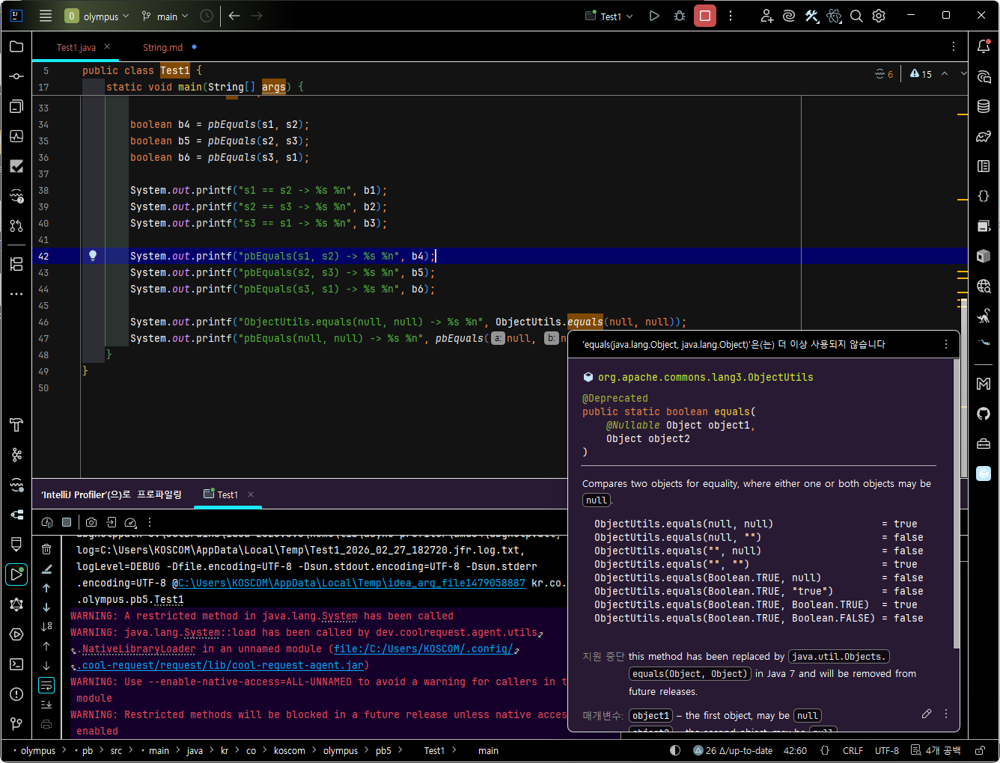
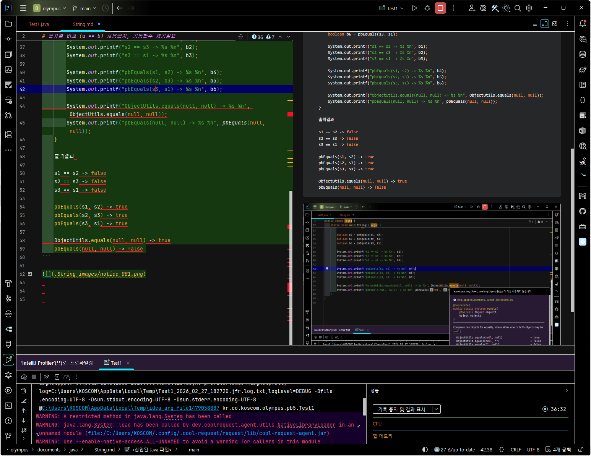

# 문자열 비교 (a == b) 사용금지, 공통함수 제공필요

```java
    /** 공통함수 제공필요 */
    static boolean pbEquals(Object a, Object b) {
        /*
            a, b 모두 null 일 때, true 로 할지 false 로 할지 결정 필요
            ObjectUtils.equals(null, null) --> true
            pbEquals(null, null) --> false
         */
        return (a != null && a.equals(b) || (b != null && b.equals(a)));
    }

    static void main(String[] args) {

        /*
            문자열 뿐만 아니라, BigDecimal, Integer, Long, Double 을 비교할 때도 동일한 현상 발생 합니다.
            if(a == b)  // 사용금지
            if(ObjectUtils.equals(a, b) // 타입이 다르면 false
         */

        String s0 = "123koscom";
        String s1 = "koscom";
        String s2 = s0.substring(3);
        String s3 = new String(s2);

        boolean b1 = s1 == s2;
        boolean b2 = s2 == s3;
        boolean b3 = s3 == s1;

        boolean b4 = pbEquals(s1, s2);
        boolean b5 = pbEquals(s2, s3);
        boolean b6 = pbEquals(s3, s1);

        System.out.printf("s1 == s2 -> %s %n", b1);
        System.out.printf("s2 == s3 -> %s %n", b2);
        System.out.printf("s3 == s1 -> %s %n", b3);

        System.out.printf("pbEquals(s1, s2) -> %s %n", b4);
        System.out.printf("pbEquals(s2, s3) -> %s %n", b5);
        System.out.printf("pbEquals(s3, s1) -> %s %n", b6);

        System.out.printf("ObjectUtils.equals(null, null) -> %s %n", ObjectUtils.equals(null, null));
        System.out.printf("pbEquals(null, null) -> %s %n", pbEquals(null, null));
    }
    
    출력결과
    
    s1 == s2 -> false
    s2 == s3 -> false
    s3 == s1 -> false

    pbEquals(s1, s2) -> true
    pbEquals(s2, s3) -> true
    pbEquals(s3, s1) -> true

    ObjectUtils.equals(null, null) -> true
    pbEquals(null, null) -> false 
```




